# Confluence Chat Bot - Architecture Design

## System Overview

Architecture design for an intelligent Confluence chatbot with smart search capabilities and natural language responses, using Google Agent Development Kit as the core engine.

## High-Level Architecture

```mermaid
graph TB
    User[👤 User Interface] --> ADK[🤖 Google ADK Agent]
    
    subgraph "Google ADK Core"
        ADK --> DateTool[📅 Date Tool]
        ADK --> ConfluenceTool[📚 Confluence Tool]
        ADK --> Router[🔀 Tool Router]
    end
    
    subgraph "Search Layer"
        ConfluenceTool --> VME[🧠 Vertex Matching Engine]
        ConfluenceTool --> ConfAPI[🔌 Confluence REST API]
        VME --> VectorDB[📊 Vector Database]
        ConfAPI --> ContentStore[💾 Content Store]
    end
    
    subgraph "AI Enhancement"
        Router --> Perplexity[🔍 Perplexity AI]
        Perplexity --> DeepSearch[🎯 Deep Search & Analysis]
    end
    
    subgraph "Data Sources"
        ConfluenceCloud[☁️ Confluence Cloud]
        TimeServices[⏰ Time Services]
    end
    
    ConfAPI --> ConfluenceCloud
    DateTool --> TimeServices
    
    style ADK fill:#e1f5fe
    style VME fill:#f3e5f5
    style Perplexity fill:#fff3e0
```



## Detailed Component Architecture

### 1. Google Agent Development Kit (Core)

```python
# Agent Configuration
agent_config = {
    "name": "confluence-search-agent",
    "description": "Intelligent assistant for Confluence content search and analysis",
    "model": "gemini-pro",
    "tools": [
        "date_tool",
        "confluence_search_tool", 
        "perplexity_deep_search_tool"
    ],
    "instructions": """
    You are an expert assistant for searching and analyzing Confluence content.
    Use the confluence tool to search for relevant information.
    Use the date tool when users ask about time-sensitive content.
    Use perplexity for deep analysis and additional context.
    Always provide accurate, helpful responses with source citations.
    """
}
```

#### Agent Tools Architecture:

**1. Date Tool**
```python
class DateTool:
    def __init__(self):
        self.name = "date_tool"
        self.description = "Get current date/time and handle temporal queries"
    
    def execute(self, query: str) -> dict:
        return {
            "current_date": datetime.now().isoformat(),
            "formatted_date": datetime.now().strftime("%Y-%m-%d"),
            "relative_time": self.parse_relative_time(query)
        }
```

**2. Confluence Tool**
```python
class ConfluenceTool:
    def __init__(self, confluence_client, vector_engine):
        self.name = "confluence_search_tool"
        self.description = "Search and retrieve content from Confluence"
        self.confluence = confluence_client
        self.vector_engine = vector_engine
    
    def execute(self, query: str, filters: dict = None) -> dict:
        # Hybrid search: Vector + Traditional
        vector_results = self.vector_engine.search(query)
        api_results = self.confluence.search(query, filters)
        
        return {
            "results": self.merge_and_rank(vector_results, api_results),
            "total_found": len(results),
            "search_type": "hybrid"
        }
```

### 2. Search Layer Architecture

#### Vertex Matching Engine Integration

```python
class VertexMatchingEngine:
    def __init__(self, project_id: str, region: str):
        self.project_id = project_id
        self.region = region
        self.client = aiplatform.MatchServiceClient()
        
    def create_index(self):
        """Create vector index for Confluence content"""
        index_config = {
            "display_name": "confluence-content-index",
            "description": "Vector index for Confluence pages and attachments",
            "metadata": {
                "config": {
                    "dimensions": 768,  # text-embedding-004 dimensions
                    "approximate_neighbors_count": 150,
                    "distance_measure_type": "DOT_PRODUCT_DISTANCE"
                }
            }
        }
        return self.client.create_index(parent=self.parent, index=index_config)
    
    def search_similar_content(self, query_embedding: List[float], num_neighbors: int = 10):
        """Search for similar content based on vector embeddings"""
        queries = [{
            "datapoint": {
                "datapoint_id": "query",
                "feature_vector": query_embedding
            },
            "neighbor_count": num_neighbors
        }]
        
        response = self.client.find_neighbors(
            index_endpoint=self.index_endpoint,
            queries=queries
        )
        
        return self.process_search_results(response)
```

#### Content Processing Pipeline

```python
class ContentProcessor:
    def __init__(self, embedding_model="text-embedding-004"):
        self.embedding_model = embedding_model
        
    def process_confluence_page(self, page_data: dict) -> dict:
        """Process and create embeddings for Confluence page"""
        
        # Extract and clean content
        content = self.extract_content(page_data)
        chunks = self.chunk_content(content)
        
        # Generate embeddings
        embeddings = []
        for chunk in chunks:
            embedding = self.generate_embedding(chunk)
            embeddings.append({
                "content": chunk,
                "embedding": embedding,
                "metadata": {
                    "page_id": page_data["id"],
                    "title": page_data["title"],
                    "space": page_data["space"]["name"],
                    "url": page_data["_links"]["webui"],
                    "last_updated": page_data["version"]["when"]
                }
            })
        
        return embeddings
    
    def chunk_content(self, content: str, chunk_size: int = 500) -> List[str]:
        """Split content into smaller chunks for effective embedding"""
        sentences = content.split('. ')
        chunks = []
        current_chunk = ""
        
        for sentence in sentences:
            if len(current_chunk + sentence) < chunk_size:
                current_chunk += sentence + ". "
            else:
                chunks.append(current_chunk.strip())
                current_chunk = sentence + ". "
        
        if current_chunk:
            chunks.append(current_chunk.strip())
            
        return chunks
```

### 3. Perplexity AI Integration

```python
class PerplexityIntegration:
    def __init__(self, api_key: str):
        self.api_key = api_key
        self.base_url = "https://api.perplexity.ai"
        
    def deep_search_analysis(self, query: str, confluence_results: List[dict]) -> dict:
        """Use Perplexity for deep analysis and information synthesis"""
        
        # Prepare context from Confluence results
        context = self.prepare_context(confluence_results)
        
        prompt = f"""
        Based on the following Confluence content, provide a comprehensive analysis for the query: "{query}"
        
        Confluence Content:
        {context}
        
        Please provide:
        1. Direct answer to the query
        2. Key insights and patterns
        3. Related topics the user might be interested in
        4. Any gaps in the available information
        """
        
        response = requests.post(
            f"{self.base_url}/chat/completions",
            headers={
                "Authorization": f"Bearer {self.api_key}",
                "Content-Type": "application/json"
            },
            json={
                "model": "llama-3.1-sonar-large-128k-online",
                "messages": [
                    {"role": "system", "content": "You are an expert analyst specializing in enterprise documentation."},
                    {"role": "user", "content": prompt}
                ],
                "max_tokens": 1000,
                "temperature": 0.2
            }
        )
        
        return response.json()
```

### 4. Data Layer Architecture

#### Content Synchronization

```python
class ContentSyncService:
    def __init__(self, confluence_client, vector_engine, scheduler):
        self.confluence = confluence_client
        self.vector_engine = vector_engine
        self.scheduler = scheduler
        
    def setup_realtime_sync(self):
        """Setup real-time synchronization with Confluence"""
        
        # Webhook to receive notifications when content changes
        @self.scheduler.scheduled_job('interval', minutes=15)
        def sync_recent_changes():
            recent_changes = self.confluence.get_recent_changes()
            for change in recent_changes:
                self.process_content_change(change)
    
    def process_content_change(self, change: dict):
        """Process content changes"""
        page_id = change["content"]["id"]
        
        if change["operation"] == "delete":
            self.vector_engine.delete_embeddings(page_id)
        else:
            # Update or create
            page_data = self.confluence.get_page_content(page_id)
            embeddings = ContentProcessor().process_confluence_page(page_data)
            self.vector_engine.upsert_embeddings(embeddings)
```

### 5. Response Generation Pipeline

```python
class ResponseGenerator:
    def __init__(self, adk_client, perplexity_client):
        self.adk = adk_client
        self.perplexity = perplexity_client
        
    def generate_response(self, user_query: str) -> dict:
        """Generate response through ADK pipeline"""
        
        # Step 1: ADK processes query and routes tools
        adk_response = self.adk.process_query(user_query)
        
        # Step 2: If deep analysis is needed, call Perplexity
        if self.needs_deep_analysis(adk_response):
            enhanced_response = self.perplexity.deep_search_analysis(
                user_query, 
                adk_response.get("confluence_results", [])
            )
            adk_response["enhanced_analysis"] = enhanced_response
        
        # Step 3: Format final response
        return self.format_final_response(adk_response)
    
    def needs_deep_analysis(self, response: dict) -> bool:
        """Determine when deep analysis with Perplexity is needed"""
        indicators = [
            "complex analysis",
            "trend analysis", 
            "comparison",
            "strategy",
            "recommendations"
        ]
        
        query = response.get("original_query", "").lower()
        return any(indicator in query for indicator in indicators)
```

## Deployment Architecture

### Infrastructure Layout

```yaml
# Google Cloud Infrastructure
services:
  adk-agent:
    type: "Cloud Run"
    cpu: "2"
    memory: "4Gi"
    environment:
      - GOOGLE_ADK_PROJECT_ID
      - CONFLUENCE_API_KEY
      - PERPLEXITY_API_KEY
      
  vertex-matching-engine:
    type: "Vertex AI"
    configuration:
      index_type: "streaming"
      machine_type: "n1-standard-4"
      
  vector-database:
    type: "Cloud SQL (PostgreSQL)"
    with_extensions: ["pgvector"]
    
  content-sync:
    type: "Cloud Functions"
    trigger: "Cloud Scheduler"
    frequency: "*/15 * * * *"  # Every 15 minutes
```

### Security Architecture

```python
class SecurityLayer:
    def __init__(self):
        self.auth_handlers = {
            "confluence": ConfluenceAuth(),
            "google_cloud": GoogleCloudAuth(),
            "perplexity": PerplexityAuth()
        }
    
    def authenticate_request(self, request):
        """Authenticate request and check permissions"""
        user = self.extract_user(request)
        
        # Check Confluence permissions
        confluence_perms = self.auth_handlers["confluence"].get_user_permissions(user)
        
        return {
            "user_id": user.id,
            "confluence_spaces": confluence_perms.accessible_spaces,
            "content_filters": self.build_content_filters(confluence_perms)
        }
```

## Performance Optimization

### Caching Strategy

```python
class CacheLayer:
    def __init__(self, redis_client):
        self.redis = redis_client
        self.cache_ttl = {
            "search_results": 300,      # 5 minutes
            "embeddings": 3600,         # 1 hour  
            "confluence_content": 900,  # 15 minutes
            "perplexity_analysis": 1800 # 30 minutes
        }
    
    def get_cached_search(self, query_hash: str):
        """Get search results from cache"""
        return self.redis.get(f"search:{query_hash}")
    
    def cache_search_results(self, query_hash: str, results: dict):
        """Cache search results"""
        self.redis.setex(
            f"search:{query_hash}",
            self.cache_ttl["search_results"],
            json.dumps(results)
        )
```

## Monitoring & Analytics

### Observability Stack

```python
class MonitoringService:
    def __init__(self):
        self.metrics = {
            "query_latency": Histogram("query_response_time_seconds"),
            "tool_usage": Counter("adk_tool_usage_total"),
            "search_accuracy": Gauge("search_result_relevance_score"),
            "user_satisfaction": Histogram("user_feedback_score")
        }
    
    def track_query_performance(self, query: str, response_time: float, tools_used: List[str]):
        """Track performance metrics"""
        self.metrics["query_latency"].observe(response_time)
        
        for tool in tools_used:
            self.metrics["tool_usage"].labels(tool=tool).inc()
```

## Scalability Considerations

### Auto-scaling Configuration

```yaml
# Kubernetes HPA Configuration
apiVersion: autoscaling/v2
kind: HorizontalPodAutoscaler
metadata:
  name: confluence-bot-hpa
spec:
  scaleTargetRef:
    apiVersion: apps/v1
    kind: Deployment
    name: confluence-bot
  minReplicas: 2
  maxReplicas: 20
  metrics:
  - type: Resource
    resource:
      name: cpu
      target:
        type: Utilization
        averageUtilization: 70
  - type: Resource
    resource:
      name: memory
      target:
        type: Utilization
        averageUtilization: 80
```

## Cost Optimization

### Resource Usage Strategy

| Component | Usage Pattern | Cost Optimization |
|-----------|---------------|-------------------|
| **Google ADK** | Per query | Cache common queries, batch processing |
| **Vertex Matching Engine** | Per search | Smart indexing, query optimization |
| **Perplexity AI** | On-demand | Only for complex analysis, result caching |
| **Confluence API** | Rate limited | Smart sync, incremental updates |

## Success Metrics

### KPIs Dashboard

```python
class KPITracker:
    def __init__(self):
        self.kpis = {
            "response_accuracy": 0.85,      # Target: >85%
            "avg_response_time": 3.0,       # Target: <3 seconds
            "user_satisfaction": 4.0,       # Target: >4.0/5.0
            "tool_success_rate": 0.95,      # Target: >95%
            "cache_hit_rate": 0.70          # Target: >70%
        }
```

This architecture design maximizes the use of Google ADK as an orchestration layer, seamlessly integrating with Vertex Matching Engine for semantic search and Perplexity AI for deep analysis, creating an intelligent and highly scalable Confluence chatbot.